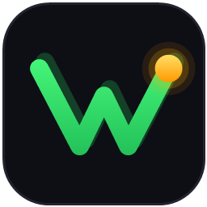
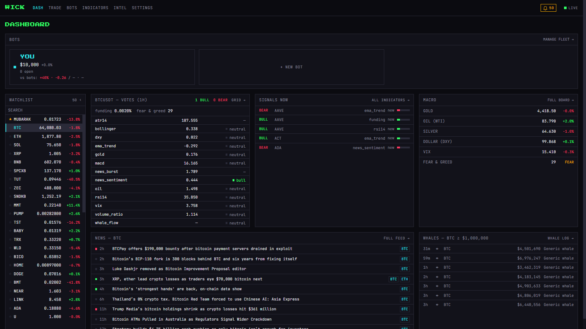
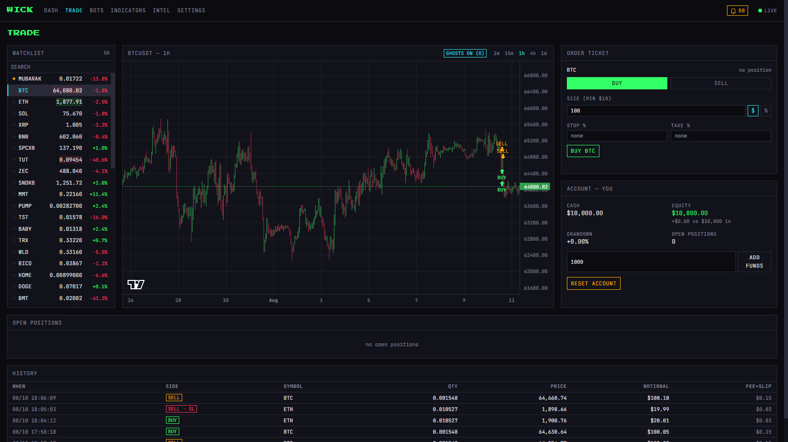
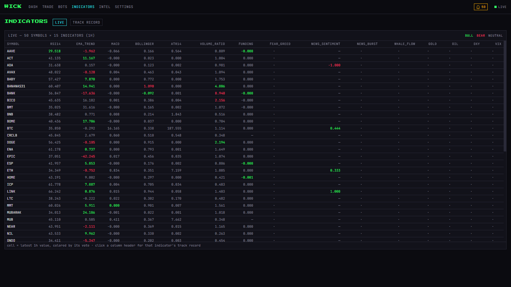
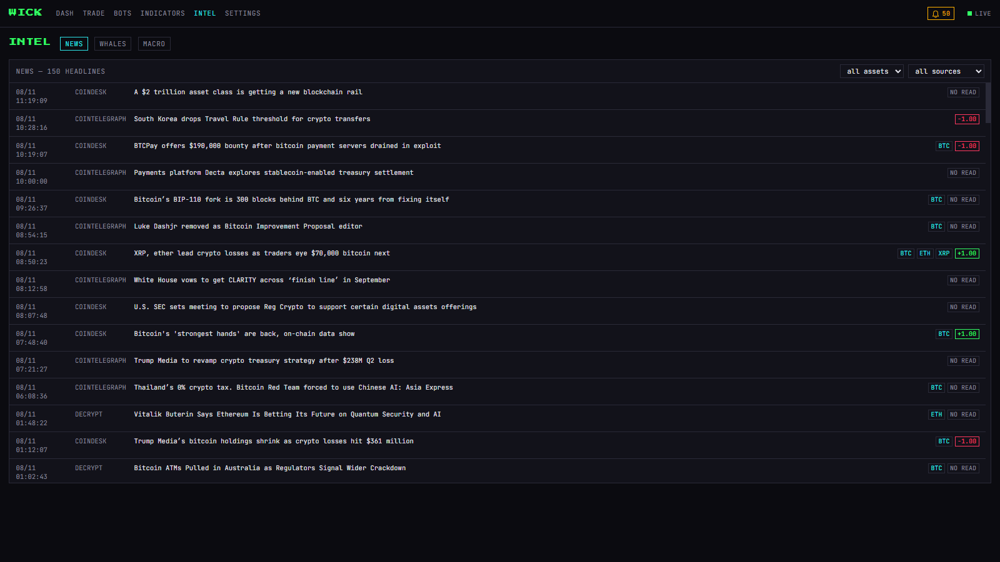

<div align="center">



# WICK

**Trading intelligence platform with self-learning LLM trading bots.**

[](https://github.com/nimrod21/Wick/commits/main)
[](https://github.com/nimrod21/Wick/stargazers)
[](apps)
[](#the-0-stack)

*Live markets · every signal tracked for predictive value · bots that pick their own indicators · you trading against them*

</div>

---

Wick watches **50 crypto markets in real time** alongside news, on-chain whale moves, and
macro (gold, oil, DXY, VIX) — and treats *everything* as an indicator. LLM-powered bots read
those signals, decide **buy / sell / wait**, and every decision is logged, scored in
hindsight, and fed back: per-indicator hit rates, per-bot journals, self-adjusted indicator
portfolios. You trade the same paper engine by hand, on the same scoreboard.

**Everything is paper money. Everything runs locally. The LLM calls ride free tiers. $0.**

## Screenshots

| Dashboard | Trade |
|---|---|
|  |  |

| Indicators — 50 × 15 live grid | Intel — news · whales · macro |
|---|---|
|  |  |

## What makes it interesting

- **Bots are agents, not scripts.** Each bot has a personality prompt, its own bankroll,
  and a portfolio of indicators it *chooses* — reviewing its own track record weekly and
  turning signals on/off, with every switch logged and reasoned.
- **Hindsight is the teacher.** Every decision (including *wait* — waiting is a decision)
  is scored at 1h/4h/24h. Indicators earn or lose weight from evidence; the Track Record
  page shows which signals actually predict anything.
- **Everything is an indicator.** RSI and MACD, sure — but also news sentiment, headline
  bursts, whale flow, gold, oil, the dollar, VIX. All vote, all get scored the same way.
- **Wake-on-event, not spam.** A code-side trigger engine pokes bots on price velocity,
  indicator crossings, volume spikes, whale moves, news bursts, macro shocks — with
  cooldowns and an LLM-budget gate. Stop-losses execute in code, never waiting for a model.
- **Anti-microtrading by construction.** Candle-close cadence, fees + slippage shown to the
  bot, cooldowns, minimum hold, max trades/day. Bots win by being right, not busy.
- **You vs bots.** Manual paper trading on the identical engine — same fees, same
  protector guarding your stops, same 4h scoreboard.

## The $0 stack

Binance public WS/REST (keyless, real-time) · RSS news + keyless BTC on-chain data ·
Yahoo macro quotes · LLM decisions via a **free-tier rotation layer** (OpenRouter free
models → Groq → Gemini → Mistral, auto-failover, daily quota ledger, self-discovering
model IDs) · SQLite · Fastify + SSE · Next.js + lightweight-charts · pm2.

## Run it

```bash
# Node 22 LTS, pnpm
pnpm install
pnpm migrate
pnpm dev          # server :3001 + web :3000
# or as a service:
pnpm build && pm2 start ecosystem.config.cjs
```

Add free LLM keys in **Settings → Providers** (signup links in
`apps/server/src/llm/README-setup.md`), create a bot, press start.

## Honest disclaimers

Paper trading only — no real money, no live order routing, and nothing here is financial
advice. The interesting output isn't profit; it's the **evidence** about which signals and
models actually carry information.

<sub>TypeScript monorepo · ~20k lines · built with an unreasonable amount of verification
(crash-audits, live soaks, measured acceptance checks). See `PLAN.md` for the design.</sub>
